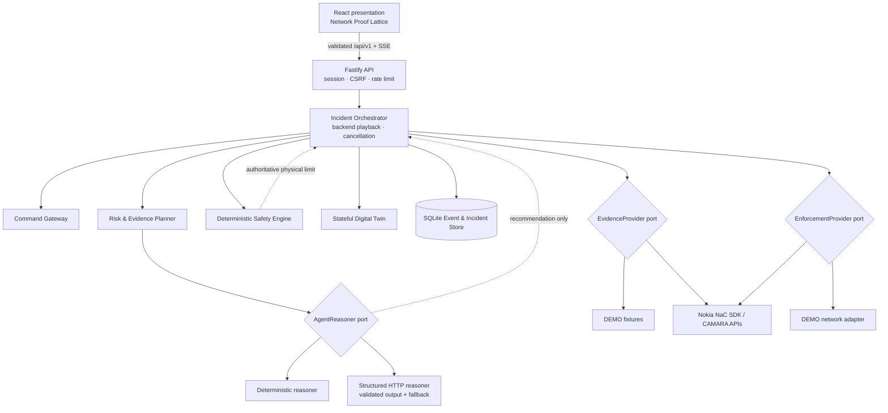
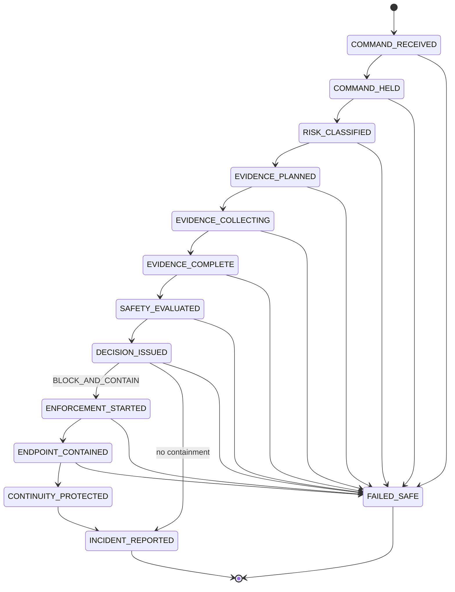

# Architecture

## Decision

HISN-OT is a TypeScript modular monolith. The prototype needs one transactional event history, one safety authority, and one reliable demo process; independent services would add failure modes without providing a meaningful deployment benefit. Ports isolate every external dependency, so persistence, reasoning, telecom evidence, and network enforcement can be separated later without changing domain rules.



## Command sequence

```mermaid
sequenceDiagram
  actor Operator
  participant UI
  participant Gateway
  participant Agent
  participant CAMARA as Nokia/CAMARA evidence
  participant Safety as Deterministic safety
  participant Network as Nokia enforcement
  participant Twin
  participant Store
  Operator->>UI: Submit 88% setpoint with valid credentials
  UI->>Gateway: POST validated command control
  Gateway->>Store: COMMAND_RECEIVED
  Gateway->>Twin: Hold request; do not change actual pressure
  Twin->>Store: COMMAND_HELD
  Gateway->>Agent: Classify consequence and plan tools
  Agent-->>Gateway: CRITICAL + five allowlisted tools
  Gateway->>CAMARA: Pre-decision evidence calls
  CAMARA-->>Gateway: Redacted typed results + provenance
  Gateway->>Safety: Evaluate 88% against policy version
  Safety-->>Gateway: Rejected; maximum 60%
  Gateway->>Agent: Interpret evidence
  Agent-->>Gateway: Structured recommendation
  Gateway->>Store: Authoritative BLOCK_AND_CONTAIN
  Gateway->>Network: Detach implicated attachment
  Gateway->>Network: Request QoD for backup flow
  Gateway->>Twin: Activate safe-control backup
  Gateway->>Store: Persist continuity and incident report
  Store-->>UI: SSE snapshot from persisted state
```

## State machine



Invalid edges throw `INVALID_TRANSITION` and are tested. Enforcement orchestration also requires the stored decision to be `BLOCK_AND_CONTAIN`.

## Module ownership

| Boundary                                | Implementation                                                  | Authority                                                                                                                                               |
| --------------------------------------- | --------------------------------------------------------------- | ------------------------------------------------------------------------------------------------------------------------------------------------------- |
| Command Gateway / Incident Orchestrator | `src/application/judge-orchestrator.ts`                         | Lifecycle, evidence/enforcement phase order, playback                                                                                                   |
| Risk and Evidence Planner               | `src/infrastructure/agent-reasoners.ts`                         | Consequence-based allowlisted plan                                                                                                                      |
| Agent Reasoning Provider                | same                                                            | Structured recommendation only; schema validation and fallback                                                                                          |
| Safety Engine                           | `src/domain/safety-engine.ts`                                   | Final physical-setpoint constraint                                                                                                                      |
| Decision Engine                         | `src/domain/decision-engine.ts`                                 | Issues the external state from deterministic identity, evidence, safety, and response policy; preserves the recommendation as non-authoritative context |
| CAMARA providers                        | `src/infrastructure/nokia-providers.ts`                         | Typed Number/SIM/Device/Location/Reachability calls                                                                                                     |
| Nokia enforcement                       | same                                                            | Specialized Network detach and QoD session                                                                                                              |
| Digital Twin                            | `src/domain/digital-twin.ts`                                    | Process state and continuity measurements                                                                                                               |
| Audit store                             | `src/infrastructure/sqlite-audit-store.ts`                      | Hash-linked events, idempotent enforcement, reports                                                                                                     |
| Authentication / authorization          | `src/server/session-guard.ts`                                   | Demo session, supervisor role, CSRF token                                                                                                               |
| Observability                           | Fastify structured logs, correlation IDs, `/healthz`, `/readyz` | Redacted operational diagnostics                                                                                                                        |

## Reliability and security mechanics

- Zod schemas validate environment, JSON configuration, HTTP input, agent output, provider output, and persisted domain data.
- Commands and enforcement use correlation IDs; enforcement records are unique by idempotency key.
- Nokia SDK calls use bounded timeouts, retries, and abort signals. Unknown failures do not become evidence.
- A provider outage becomes `UNAVAILABLE`, and critical policy blocks. Unexpected orchestration failure enters `FAILED_SAFE` while the held command is marked blocked.
- Server secrets never enter Vite configuration or browser responses. Structured log redaction covers authorization, cookies, and CSRF headers.
- SQLite WAL and a hash-linked event chain support deterministic replay and audit-tamper detection. The hash chain is tamper-evident, not a digital signature or external timestamp authority.

## Production path

Replace the in-memory demo session with the operator's identity provider and durable authorization store; provide Nokia NaC application authorization, operator consent, network identifiers, QoS profile, and slice attachment; replace the twin-only safe-control adapter with a certified, site-specific OT gateway integration; use managed storage and externally anchored audit signatures. These gaps are intentionally not disguised by DEMO mode.
