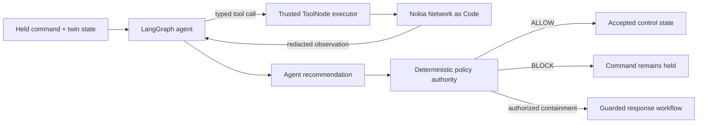

# HISN-Oil

**Agentic Network-Enforced Safety Gate for Remote Energy Infrastructure**

> No critical command becomes a physical action without network proof.

[](https://hisn-ot-prototype.vercel.app/#judge)
[](https://github.com/Mutasem-mk4/hisn-ot-prototype/actions/workflows/ci.yml)
[](https://www.hackerearth.com/community/challenges/hackathon/mena-ignite-hackathon/)

HISN-Oil protects a remote oil pumping station from valid-credential attacks. A bounded LangGraph agent selects Nokia Network as Code/CAMARA evidence tools, observes their results, and can adapt its next call. A separate deterministic policy engine decides whether the command may reach the modeled controller.

The industrial plant is a clearly labeled digital twin. Nokia responses show their real provenance, and the model never receives provider credentials or physical authority.

## Run the judged proof

### [Open Judge Mode](https://hisn-ot-prototype.vercel.app/#judge)

1. Select **Run attack demonstration**. A valid account requests **52%**, inside the independent **60%** hard limit.
2. Watch the result and compare requested pressure with accepted plant pressure. Open **How was this decision made?** to inspect the four-step protection path and agent evidence.
3. Confirm the outcome panel shows **52% requested**, **hard limit passed**, and the previous accepted setting unchanged. Network context, not the engineering maximum, is the decisive blocker.
4. Expand **Show technical trace** or open **Evidence Trace** to inspect model-requested tools, observations, provenance, adaptation, recommendation, and the authoritative policy result.
5. Use **Run trusted comparison** to submit the same 52% command with reassuring network context, then use **Run read-only inspection** to show the one-call path.

Expected invariant: the blocked request never changes the previously accepted control value.

## What makes the agent real



The connected agent chooses from five allowlisted, typed tools:

- Number Verification
- SIM Swap
- Device Swap
- Location Verification
- Device Reachability

LangGraph executes the model/tool/observation loop. The application injects trusted run context, invokes the existing Nokia adapters, validates every result with Zod, enforces a five-call budget, rejects duplicate calls, and records an inspectable action trace. The graph reminds the model when required evidence is missing; if the model still stops early or becomes unavailable, the workflow fails closed without substituting a rule-based recommendation.

Number Verification remains available in the separate five-API diagnostic with Nokia simulator OAuth. The judged flow does not establish live subscriber possession. It starts pressure control with Location Verification and Device Reachability; a failed usable observation expands the evidence floor to SIM Swap and Device Swap. Unavailable baseline evidence blocks the command without claiming compromise. This assurance profile must be revisited for operator deployment.

The final decision remains deterministic. Model output cannot change the 60% command maximum, authorize missing evidence, detach a gateway, or activate backup control by itself.

## Honest integration status

| Capability            | Deployed path                               | Boundary                                                     |
| --------------------- | ------------------------------------------- | ------------------------------------------------------------ |
| Agent orchestration   | LangGraph.js with a hosted Groq model       | Advisory evidence selection and recommendation; fails closed |
| SIM Swap              | Authenticated Nokia sandbox API             | Simulator identity                                           |
| Device Swap           | Authenticated Nokia sandbox API             | Simulator identity                                           |
| Location Verification | Authenticated Nokia sandbox API             | Simulator identity                                           |
| Device Reachability   | Authenticated Nokia sandbox API             | Simulator identity                                           |
| Number Verification   | Nokia sandbox fast OAuth in connected proof | Simulator authorization; not live subscriber consent         |
| Quality on Demand     | Authenticated Nokia sandbox request         | Observed sessions may remain pending; no handover is claimed |
| Slice detachment      | Guarded Nokia attachment adapter            | Unavailable unless the targeted attachment exists            |
| Plant and PLC         | Stateful digital twin                       | No physical PLC or calibrated plant claim                    |

The UI uses the same provenance vocabulary throughout: `LANGGRAPH AGENT`, `NOKIA SANDBOX`, `LIVE`, `FALLBACK`, `UNAVAILABLE`, and `IMPLEMENTED LOCALLY`.

## Run locally

Requires Node.js 22.18 or later.

```powershell
git clone https://github.com/Mutasem-mk4/hisn-ot-prototype.git
cd hisn-ot-prototype
npm ci
Copy-Item .env.example .env.local
npm run doctor
npm run build
npm start
```

Open [http://127.0.0.1:4310/#judge](http://127.0.0.1:4310/#judge).

The copied environment starts safely with a clearly labeled deterministic replay and simulated evidence. Uncomment and configure the three `HISN_LLM_*` values to let `HISN_AGENT_PROVIDER=AUTO` use Groq. Replace the Nokia placeholder key and set `HISN_NOKIA_SIMULATOR=true` to use the test network. `.env.local` and secrets must remain outside Git.

Useful checks:

```powershell
npm run doctor
npm run verify
npm run test:e2e
npm run audit:deps
```

## Repository guide

- [Architecture and agent graph](docs/architecture.md)
- [Nokia/CAMARA integrations and provenance](docs/integrations.md)
- [Safety and security case](docs/safety-and-security.md)
- [Judge demo and questions](docs/demo-and-judging.md)
- [Submission description, demo script, and final checklist](docs/submission-pack.md)
- [Strict connected verification and current limitations](docs/connected-verification.md)
- [Verification evidence](docs/verification.md)
- [Product definition](PRODUCT.md)
- [Interface design system](DESIGN.md)

HISN-Oil aligns with the MENA Ignite **Industrial & Enterprise AI Automation** theme and uses a simulated remote oil pumping station as its anchor MENA energy-infrastructure use case. The same network proof-of-authority pattern can extend to energy, ports, oil and gas, factories, airports, and hospitals.
