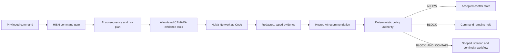

# HISN-OT

**Agentic network-enforced safety for critical infrastructure**

> No critical command becomes a physical action without network proof.

[](https://hisn-ot-prototype.vercel.app/#judge)
[](https://github.com/Mutasem-mk4/hisn-ot-prototype/actions/workflows/ci.yml)
[](https://www.hackerearth.com/community/challenges/hackathon/mena-ignite-hackathon/)

HISN-OT is a working safety-gate prototype for the **MENA Ignite Hackathon — Industrial & Enterprise AI Automation** theme. It combines an AI agent, Nokia Network as Code/CAMARA signals, deterministic engineering policy, and a stateful desalination digital twin.

A privileged command may carry valid credentials while coming from a recently swapped SIM, an unexpected device, or outside the approved facility. HISN-OT holds that command before control, gathers the network evidence required for its risk, and releases it only when telecom context and deterministic process limits agree.

## Try the proof

### [Launch Judge Mode →](https://hisn-ot-prototype.vercel.app/#judge)

The clearest demonstration takes about two minutes:

1. Click **Run read-only inspection · 1 API**. The agent classifies the consequence as `LOW`, selects only Device Reachability, and authorizes the read without changing control state.
2. Open [Evidence Trace](https://hisn-ot-prototype.vercel.app/#evidence) to see the tool-selection reason and the Nokia result's provenance, latency, timestamp, and correlation ID.
3. Return to Judge Mode, click **Submit safe change · 52%**, and run the proof. The critical request selects five tools, reaches `ALLOW`, changes the accepted setpoint to 52%, and drives the modeled facility response.
4. Click **Submit unsafe change · 88%**. The same gate holds the new request while the previously accepted control state remains unchanged.
5. Follow the agent through Nokia evidence collection and the independent 60% command limit, then open [Incident](https://hisn-ot-prototype.vercel.app/#incident) for the evidence-bound decision, containment result, continuity state, recovery requirements, and exportable report.

The result is concise: **identity valid, context compromised, command blocked, zero unsafe executions.**

## Why the Nokia APIs matter

The APIs are decision inputs, not isolated demo buttons. A successful HTTP request can still return evidence of compromise—for example, `swapped: true` or a failed location match. The agent explains why each signal is required, and the deterministic policy converts the normalized evidence into control authority.

| Capability                         | What HISN-OT asks                                                        | Why it changes the decision                                                             | Public demo provenance                                                                               |
| ---------------------------------- | ------------------------------------------------------------------------ | --------------------------------------------------------------------------------------- | ---------------------------------------------------------------------------------------------------- |
| **Number Verification**            | Is the session bound to the enrolled operator number?                    | Prevents credentials alone from proving possession of the expected subscriber identity. | **Implemented locally** because subscriber OAuth is not configured. The fallback reason is recorded. |
| **SIM Swap**                       | Was the subscription reassociated within the configured window?          | Detects a common account-takeover signal before privileged control.                     | **Nokia sandbox API**                                                                                |
| **Device Swap**                    | Did the subscriber identity move to an unexpected device?                | Detects endpoint replacement that credentials cannot reveal.                            | **Nokia sandbox API**                                                                                |
| **Location Verification**          | Is the device inside the approved facility boundary?                     | Adds network-verified presence to a high-impact remote command.                         | **Nokia sandbox API**                                                                                |
| **Device Reachability**            | Is the device reachable on the expected mobile service?                  | Distinguishes an attached endpoint from a simple offline condition.                     | **Nokia sandbox API**                                                                                |
| **Quality on Demand**              | Can the separately enrolled backup flow receive its requested treatment? | Backup ownership is withheld unless continuity is confirmed.                            | **Nokia sandbox API**, currently `PENDING`; the session is released after the rehearsal.             |
| **Specialized Network attachment** | Can the implicated operator-facing edge be detached?                     | Contains the suspicious command path after an authorized containment decision.          | **Implemented locally** because no operational slice attachment is configured.                       |

The UI always separates external transport from the modeled subject:

- `NOKIA SANDBOX` means an authenticated Nokia test-network response using simulator identities.
- `LIVE LLM` means the hosted reasoning provider returned schema-valid output.
- `IMPLEMENTED LOCALLY` means the result came from the digital twin or a clearly explained deterministic fallback.

No simulated action is presented as operator-network enforcement or physical PLC actuation. The complete capability ledger is in [API_PROVENANCE.md](API_PROVENANCE.md).

## The agentic decision loop



The AI performs two bounded jobs:

1. **Plan:** classify consequence and select the required tools from the server allowlist. A read-only inspection needs one Device Reachability check; pressure control requires five evidence tools.
2. **Recommend:** interpret the returned telecom signals and produce a strict structured recommendation.

The model cannot authorize a physical setpoint. Server-side schemas constrain its output, malformed or unavailable model responses fall back deterministically, and the policy engine independently re-evaluates authorization, evidence completeness, contextual anomalies, and the configured engineering maximum.

## Four behaviors judges can verify

| Scenario                     | Network and process context                                                   | Authoritative result | Observable safety property                                                                                              |
| ---------------------------- | ----------------------------------------------------------------------------- | -------------------- | ----------------------------------------------------------------------------------------------------------------------- |
| Read-only inspection         | Low consequence; one Nokia Device Reachability call                           | `ALLOW`              | The inspection completes without changing requested, accepted, or actual pressure and starts no enforcement.            |
| Safe operating change        | Critical consequence; five evidence tools; requested 52%; hard maximum 60%    | `ALLOW`              | Accepted input becomes 52% and the digital twin responds progressively.                                                 |
| Compromised critical command | Recent SIM/device changes, location mismatch, reachable device; requested 88% | `BLOCK_AND_CONTAIN`  | The accepted input does not change; the operator edge is isolated locally; unconfirmed continuity safe-stops the model. |
| Provider degradation         | Required evidence is unavailable                                              | `BLOCK`              | Uncertainty prevents authorization but is not misreported as confirmed compromise, so containment does not execute.     |

This distinction matters: missing evidence fails closed, while containment requires affirmative compromise evidence and a stored `BLOCK_AND_CONTAIN` decision.

## Integration truth

| Layer                           | Deployed implementation                                                                                    | Boundary                                                                                                |
| ------------------------------- | ---------------------------------------------------------------------------------------------------------- | ------------------------------------------------------------------------------------------------------- |
| Nokia evidence                  | Authenticated test-network calls for SIM Swap, Device Swap, Location Verification, and Device Reachability | Simulator identities; Number Verification still needs subscriber OAuth.                                 |
| Nokia programmable connectivity | QoD session creation, polling, and release                                                                 | The observed session remained `REQUESTED`, so HISN-OT records `PENDING` and grants no backup ownership. |
| AI agent                        | Hosted Groq-compatible structured reasoning with deterministic fallback                                    | Advisory only; deterministic policy is authoritative.                                                   |
| Safety workflow                 | Backend state machine, evidence plan, decision, containment ordering, incident generation                  | Implemented and tested in this repository.                                                              |
| Industrial process              | Stateful first-order desalination digital twin with integration steps of at most 100 ms                    | Illustrative model; no physical PLC, Modbus, or calibrated plant claim.                                 |
| Persistence                     | SQLite migrations and hash-linked event history                                                            | Suitable for this single-process prototype; not durable multi-user Vercel storage.                      |

The current limitation is deliberate and visible: when Nokia QoD remains pending, HISN-OT does not claim a successful network handover. It withholds backup ownership and safe-stops the modeled pump.

## Architecture and safety controls

HISN-OT is a TypeScript modular monolith with explicit ports around every external dependency:

- **React** renders only backend snapshots, including the facility schematic, evidence paths, telemetry, and playback state.
- **Fastify** exposes versioned APIs, signed DEMO sessions, CSRF validation, rate limits, health/readiness checks, and server-sent updates.
- **Application orchestration** owns the command lifecycle, cancellation, evidence/enforcement ordering, and incident construction.
- **Domain modules** own the state machine, evidence semantics, decision policy, hard safety limit, and digital twin.
- **Infrastructure adapters** isolate Nokia Network as Code, hosted reasoning, deterministic fallbacks, and SQLite persistence.

Additional controls include Zod validation at configuration and trust boundaries, bounded provider timeouts, retries only where safe, persisted enforcement intent, idempotency keys, redacted results, correlation IDs, and SHA-256 event-chain integrity. See [ARCHITECTURE.md](ARCHITECTURE.md), [SAFETY_CASE.md](SAFETY_CASE.md), and [THREAT_MODEL.md](THREAT_MODEL.md).

## Regional and commercial path

The anchor use case is a connected desalination facility: a high-value MENA asset where remote automation, operator mobility, and cyber-physical consequences meet. The same command-gate pattern can be configured for oil and gas, energy, ports, factories, airports, hospitals, and smart-city infrastructure.

A practical commercialization path is a per-site or per-critical-asset safety layer integrated with the operator's identity provider, telecom application credentials, network slice attachments, and certified OT gateway. Customers gain one evidence trail connecting the operator, network context, engineering policy, command outcome, and recovery workflow. The remaining work for operational use is documented in [LIVE_INTEGRATION.md](LIVE_INTEGRATION.md).

## Verification evidence

The September 10 verification baseline includes:

- `npm run verify`: formatting, ESLint, server/web type checks, **69 Vitest tests**, and production build passed.
- `npm run test:e2e`: **22 passed**, with two intentional small-screen skips for the full safe-then-unsafe presentation sequence.
- Accessibility and browser-console checks passed on desktop, projector, tablet, and mobile profiles.
- `npm run audit:deps`: **0 vulnerabilities** reported by npm.
- Public `/`, `/healthz`, and `/readyz` returned HTTP 200.
- Authenticated public rehearsals returned `ALLOW` for 52% and `BLOCK_AND_CONTAIN` for 88%, with zero unsafe executions.

The CI workflow runs formatting, linting, type checking, tests, and the production build on every push. Detailed findings and reproducible boundaries are recorded in [AUDIT_LEDGER.md](AUDIT_LEDGER.md).

## Run locally

Requirement: Node.js 22.18 or later.

```powershell
git clone https://github.com/Mutasem-mk4/hisn-ot-prototype.git
cd hisn-ot-prototype
npm ci
npm run build
npm start
```

Open [http://127.0.0.1:4310/#judge](http://127.0.0.1:4310/#judge). Local `DEMO` mode needs no secrets and uses deterministic CAMARA-shaped fixtures. External credentials belong in environment variables described by [.env.example](.env.example); they must never enter source control or browser code.

### Useful commands

```powershell
npm run verify
npm run test:e2e
npm run test:rehearsal
npm run audit:deps
npm run sample:report
```

`npm run sample:report` regenerates the [redacted incident example](artifacts/sample-incident-report.json) through the production orchestration path. `npm run visual:qa` requires a running production server and captures desktop, projector, tablet, and mobile views.

## Runtime modes

| Mode      | Behavior                                                                                                                                                          |
| --------- | ----------------------------------------------------------------------------------------------------------------------------------------------------------------- |
| `DEMO`    | Reproducible fixtures by default. With Nokia simulator configuration enabled, calls the Nokia test network first and visibly falls back per capability.           |
| `SANDBOX` | Uses configured Nokia adapters without fixture fallback. Interactive APIs remain disabled until enterprise identity and durable command-to-gateway binding exist. |
| `LIVE`    | Requires complete Nokia configuration. Interactive APIs and automatic advancement remain disabled; this is not an operational live-control mode.                  |

## Documentation map

- [Quickstart and presenter controls](QUICKSTART.md)
- [105-second demo script](DEMO_SCRIPT.md)
- [Architecture](ARCHITECTURE.md)
- [API provenance](API_PROVENANCE.md)
- [Judging matrix](JUDGING_MATRIX.md)
- [Judge Q&A](JUDGE_QA.md)
- [Safety case](SAFETY_CASE.md)
- [Threat model](THREAT_MODEL.md)
- [Live integration requirements](LIVE_INTEGRATION.md)
- [Repair and verification ledger](AUDIT_LEDGER.md)
- [Evidence ledger](EVIDENCE_LEDGER.md)

---

**HISN-OT asks the question credentials cannot answer: _should this command execute here, now, on this device, under this network context?_**
