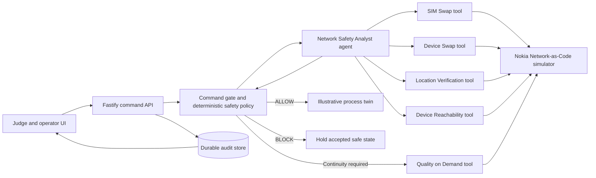

# HISN-OT Winning Implementation Plan

## Executive decision

HISN-OT should remain the product. The desalination digital twin, command gate, safety policy, incident record, and judge-facing interface already form a strong and unusually complete foundation. Replacing them with a new Python or Node-RED demo would discard the project’s strongest work and consume the remaining submission window.

The decisive upgrade is to make the existing story externally verifiable:

1. Replace fixture-only telecom evidence with authenticated calls to Nokia Network-as-Code simulator devices.
2. Replace the custom, unverified reasoning gateway with one approved AI agent framework and a real model call.
3. Show an audit trail that distinguishes a real API call from the simulated network device and from the illustrative process twin.
4. Deploy one stable end-to-end build and produce the exact three submission artifacts.

The official competition still calls Phase 2 a “working prototype.” A production mobile-operator contract or physical PLC is not required. Nokia’s hackathon instructions explicitly encourage simulator numbers and say that developers may self-register without organizational setup. The right standard is therefore a real, authenticated Nokia API integration and a real AI-agent run, with truthful simulator provenance.

No plan can guarantee a win. This plan maximizes the scoreable evidence under the remaining time by concentrating on the published criteria: regional relevance, technical depth, Open Gateway API usage, agentic orchestration, stability, commercial viability, and presentation.

## Confirmed competition requirements

The prototype phase ends on **September 13, 2026 at 18:29 UTC**, which is **21:29 in Amman**. The team should freeze the submission package at least three hours earlier.

The official problem statement requires all of the following:

- alignment with one of seven themes;
- at least one CAMARA API available through Nokia Network-as-Code;
- an AI agent layer that uses telecom signals as trusted data sources and intelligently orchestrates one or more CAMARA APIs;
- use of only tools listed in the mandatory Resource & Tooling Guide for the AI-agent component;
- original code that addresses a real problem.

The selected **Industrial & Enterprise AI Automation** theme explicitly names Quality on Demand, Device Status, and Network Intelligence as relevant APIs. Multiple APIs, intelligent orchestration, secure design, scalability, and 5G optimization are listed as strengths.

The submission package has three parts:

| Deliverable           | Required content                                                                                                                                                                                  |
| --------------------- | ------------------------------------------------------------------------------------------------------------------------------------------------------------------------------------------------- |
| Idea Capture Template | Idea name and date; submitter and team details; problem, solution, and benefits; project type and GSMA alignment; one theme; API usage                                                            |
| Pitch deck            | Problem and context; solution and API usage; approved AI-agent tools and orchestration; architecture; business model; screenshots or video links; team biographies and roles                      |
| Virtual demo          | Screen-recorded video of no more than three minutes; working prototype, API calls, and UI/UX; code repository link; demo and commercial-value summaries; API synopsis; business-impact statements |

Phase 2 judges add explicit emphasis on end-to-end stability, depth of API integration, smooth UX, agentic multi-API orchestration, scalability, commercial readiness, and pitch clarity.

## Current position

### What is already competitive

- A polished, responsive facility interface with a coherent safe-then-unsafe story.
- A backend-owned state machine, digital twin, authorization boundary, and deterministic physical safety policy.
- Requested, accepted, and measured pressure are separate; a blocked command cannot alter accepted control state.
- Hash-linked audit events, incident export, idempotency, provider deadlines, fail-safe behavior, and browser rehearsals.
- A pinned `network-as-code@10.0.0` TypeScript SDK and typed provider ports.
- A public GitHub repository, CI workflow, hosted demo, and extensive test coverage.

### What currently prevents a strong final submission

| Gap                                                                                                                        | Consequence                                                                       | Required repair                                                                            |
| -------------------------------------------------------------------------------------------------------------------------- | --------------------------------------------------------------------------------- | ------------------------------------------------------------------------------------------ |
| Telecom calls in the delivered judge path are fixtures                                                                     | The app cannot demonstrate mandatory external API usage                           | Add an explicit `NOKIA_SIMULATOR` mode using authenticated Nokia SDK calls                 |
| The Groq-compatible reasoner is deployed with deterministic fallback                                                       | The public link proves the hosted-agent path while remaining available on failure | Capture both live-provider and forced-fallback evidence in the final demonstration         |
| SANDBOX/LIVE interactive routes are disabled                                                                               | Judges cannot run the external path through the product UI                        | Introduce a hackathon-safe simulator mode with server-side secrets and bounded permissions |
| The Nokia configuration requires values unnecessary for simulator evidence, including a bearer token and slice identifiers | Setup is harder than Nokia’s published simulator flow                             | Separate simulator configuration from production/operator configuration                    |
| Location uses a passthrough request despite SDK v10 exposing `location.verifyV1`                                           | Extra contract risk and less persuasive SDK evidence                              | Use the typed SDK method                                                                   |
| The current QoD code expects immediate `AVAILABLE`                                                                         | A valid session can initially be `REQUESTED`                                      | Persist the session ID and poll or reconcile until `AVAILABLE`, `UNAVAILABLE`, or timeout  |
| Specialized-network detach requires an existing authorized slice attachment                                                | It is unlikely to work in a self-registered simulator account                     | Keep it as an optional capability; do not make it part of the core judged claim            |
| The latest product work exists only as local uncommitted changes                                                           | The public repository and deployed build do not show the strongest implementation | Review, commit, push, and deploy only after the real integration passes all gates          |
| No submission documents or three-minute video are present                                                                  | A strong product could still be incomplete at judging                             | Produce all three required artifacts and rehearse them against the published criteria      |

## Product thesis

**HISN-OT is an AI-orchestrated network safety gate that verifies the mobile-network context of high-impact industrial commands before releasing them to operational control.**

The memorable demonstration remains:

> A valid operator identity is not enough. HISN-OT checks live network intelligence, rejects an unsafe or context-compromised command, and preserves the previously accepted safe state.

This is stronger than a generic fraud bot because the network APIs change a visible industrial outcome. It is more credible than an autonomous LLM shutdown because the model gathers and interprets evidence while deterministic policy retains final physical authority.

The commercial buyer is a water utility, energy operator, port, industrial campus, or managed OT-security provider. The initial offer is a per-site or per-protected-asset subscription, with network API consumption passed through or bundled through an MNO partnership. The expansion path is configuration rather than a rewrite: asset policies, geofences, command types, operator identities, and continuity profiles change by deployment.

## Target architecture

### Authority model

The AI agent may:

- classify command consequence and select relevant evidence tools from a server-controlled allowlist;
- call Nokia evidence APIs through typed function tools;
- summarize observed signals and recommend `ALLOW`, `STEP_UP`, `BLOCK`, or `BLOCK_AND_CONTAIN`;
- explain which evidence affected its recommendation.

The AI agent may not:

- modify the 60% hard command maximum or any deterministic policy;
- directly write an accepted setpoint;
- invent missing evidence;
- convert API errors into successful evidence;
- claim a network action completed until the Nokia response reaches the required state;
- call an arbitrary URL or tool outside the allowlist.

This division both satisfies the agentic requirement and creates a defensible safety argument.

## Real Nokia integration

### APIs for the final judged path

Use five APIs, with four as evidence tools and one as continuity enforcement:

| Tool                  | Purpose                                                    | Safe simulator identity                  | Compromised simulator identity                         |
| --------------------- | ---------------------------------------------------------- | ---------------------------------------- | ------------------------------------------------------ |
| SIM Swap              | Detect recent subscription takeover                        | `+99999991001` -> no recent swap         | `+99999991000` -> recent swap                          |
| Device Swap           | Detect unexpected hardware reassociation                   | no recent swap                           | recent swap                                            |
| Location Verification | Verify presence in the facility circle                     | `TRUE`                                   | `FALSE`                                                |
| Device Reachability   | Verify current data-network availability                   | reachable over `DATA`                    | reachable over `SMS` only                              |
| Quality on Demand     | Request protected connectivity for the trusted backup flow | create `QOS_L`, then reconcile lifecycle | invoked only after policy authorizes continuity action |

These mappings were verified on September 9 with the supplied application key against Nokia’s service. All eight evidence requests returned successful HTTP responses matching the documented simulator scenarios. A QoD session was also created with status `REQUESTED` and then deleted successfully. The key is therefore valid and the external integration is technically unblocked.

The UI must label each result with two separate facts:

- **Transport:** `REAL NOKIA API`
- **Subject:** `SIMULATED DEVICE`

Calling the API “live network telemetry” would be misleading. Calling it merely “simulated” would hide the strongest technical achievement. The two-label model is accurate and persuasive.

### Configuration

Add a dedicated `NOKIA_SIMULATOR` provider mode or equivalent configuration that needs only:

- `NOKIA_NAC_API_KEY`
- `NOKIA_NAC_RAPIDAPI_HOST=network-as-code.nokia.rapidapi.com`
- safe and compromised simulator identifiers
- facility circle and QoD application-server values

Keep production/operator configuration separate. The application key stays in local and hosting environment secrets and never enters Git, incident exports, browser state, logs, screenshots, or traces.

### Reliability rules

- Use the typed Nokia SDK for every supported endpoint.
- Set one overall workflow deadline and smaller per-tool deadlines.
- Allow only bounded retries for read-only evidence calls; do not blindly retry a mutating QoD request without idempotent reconciliation.
- Store a hash of the redacted response, SDK version, API name, latency, timestamp, correlation ID, model ID, and agent trace ID.
- Treat `UNKNOWN`, malformed responses, rate limits, and timeouts as unknown evidence that blocks authorization without falsely counting as confirmed compromise.
- Poll a new QoD session until `AVAILABLE`, `UNAVAILABLE`, or deadline; clean up sessions after rehearsals.
- Maintain a clearly labeled offline rehearsal mode, but never substitute cached data while displaying `REAL NOKIA API`.

## Approved zero-cost AI agent implementation

Do not make a paid OpenAI account or a privately running server a project dependency. The mandatory guide explicitly lists Groq as a free hosted model provider. Use the existing typed `AgentReasoner` boundary and support this provider order:

1. **Groq free tier** for the hosted judge build and recorded demonstration.
2. The existing **deterministic reasoner** as the immediate fail-safe when Groq is absent, slow, rate-limited, or returns invalid output.

Ollama remains useful for developer experiments, but it is not part of the submitted runtime because judges cannot reach a model running on a team laptop. A local Qwen3 4B benchmark on the target laptop also produced invalid risk classifications and duplicate native tool calls. It is unsuitable as the authoritative planner.

The model is advisory and never owns the safety decision. A Groq outage may change the displayed provenance to `DETERMINISTIC FALLBACK`; it must not interrupt the workflow, authorize a command, or change the accepted setpoint. This design costs nothing, complies with the guide, and is more reliable than making a paid frontier model part of the command path.

The agent should be one focused **Network Safety Analyst**, not a theatrical collection of agents. Its tools are server-side wrappers around the Nokia provider:

- `check_sim_swap`
- `check_device_swap`
- `verify_facility_location`
- `get_device_reachability`

The orchestration contract is:

1. Receive a redacted command, principal role, policy metadata, and process state.
2. Select the minimum sufficient tools subject to policy-required evidence.
3. Call the tools; the backend executes the actual Nokia SDK requests.
4. Return a structured recommendation with observed signals, confidence limits, and a concise explanation.
5. Pass the result to the deterministic decision engine, which independently enforces authorization, evidence completeness, and the hard physical limit.

For the judged critical command, policy requires all five tools, including Number Verification. For a read-only request, the agent chooses only Number Verification. Showing this contrast proves adaptive orchestration rather than a fixed sequence with AI-flavored text.

Use Groq strict structured outputs with `openai/gpt-oss-20b`, strict Zod validation, a bounded output, cancellation signals, an overall deadline, and redacted application tracing. Tests should use a scripted model boundary so the main suite remains deterministic. Before recording, rehearse hosted-model success and forced model failure with deterministic fallback.

Do not describe deterministic fallback as a live model. The judge interface should identify `GROQ` or `DETERMINISTIC FALLBACK` and show which path handled each run. The submitted video should capture at least one real Groq run plus the fallback demonstration.

## User experience for judges

Keep the current facility schematic. Add a compact **External Proof** strip visible without scrolling:

- Nokia connection: connected/degraded
- Agent: model ID and real/fallback status
- API calls: completed/required count
- Provenance: real API / simulated device
- Correlation ID and total decision latency

During each tool call, animate the evidence path and show a human-readable purpose. After completion, reveal the result, latency, and provenance. Avoid exposing raw phone numbers, keys, detailed chain-of-thought, or unredacted provider payloads.

The three-minute demo should show:

1. A 52% request succeeds after real Nokia simulator evidence and visibly changes the process twin.
2. An 88% request is held while the AI agent chooses and calls the CAMARA tools.
3. Real Nokia results show a recent SIM swap, recent device swap, and location mismatch.
4. The deterministic 60% ceiling independently fails the request.
5. The accepted value remains 52%; the unsafe command records zero executions.
6. A real QoD session is requested for the trusted continuity flow and reconciled truthfully.
7. The incident report links the command, agent run, API evidence, deterministic policy, and continuity action.

## Deployment strategy

Use the existing Vercel project for the submitted link so judges can reach both the interface and hosted Groq reasoner without a team-operated server. Browser-issued bounded `TICK` requests keep the illustrative process moving while the page is open. Verify the complete workflow repeatedly on the deployed URL after every production change.

For persistence, use a managed PostgreSQL service listed in the guide, such as Neon or Supabase, through a new `AuditStore` adapter. Keep SQLite for local tests. If the Postgres adapter threatens the core deadline, deploy a single-instance service with clearly documented persistence limits and finish external persistence only after the real Nokia and AI paths are stable.

Deployment secrets:

- Nokia application key
- Groq API key
- model identifier
- simulator identifiers and facility configuration
- database connection string if external persistence is completed

The deployment must expose health and readiness separately. Readiness should report Nokia and model configuration without making paid or state-changing calls. A protected diagnostic endpoint may perform a manual external smoke test and return only redacted results.

## Verification gates

No “real” badge ships until all gates pass.

### Gate 1: provider contracts

- Safe and compromised simulator identities produce the expected four Nokia outcomes.
- Location uses `verifyV1` with a complete circle.
- Errors preserve provider status and never become false evidence.
- QoD handles `REQUESTED`, `AVAILABLE`, and `UNAVAILABLE`, including cleanup.

### Gate 2: agent behavior

- A critical command causes real tool calls through the approved agent framework.
- Tool selection is bounded by the server allowlist and required-evidence policy.
- Malformed, tool-free, over-budget, or contradictory model outputs fail safely.
- The deterministic engine cannot be overridden by the model.
- No sensitive inputs are exported in model traces.

### Gate 3: end-to-end safety

- Safe command reaches `ALLOW` and accepted setpoint becomes 52%.
- Unsafe command reaches `BLOCK_AND_CONTAIN` while accepted setpoint remains 52%.
- Unknown-provider scenario reaches `BLOCK` without false containment.
- QoD cannot grant backup ownership until confirmed by the modeled handover contract.
- Refresh, replay, pause, reset, and incident export remain correct.

### Gate 4: deployment

- Five consecutive hosted rehearsals complete without console errors or manual repair.
- A cold start and a provider timeout both produce understandable, safe UI states.
- Secrets are absent from Git history, build output, browser bundles, logs, screenshots, and incident JSON.
- CI, dependency audit, accessibility, and responsive browser checks pass.

### Gate 5: submission

- Every judge-facing claim maps to a screen, test result, API record, or cited source.
- The repository README starts with a 30-second setup and a truthful integration matrix.
- The deck, template, and demo use identical terminology and metrics.
- The video is under three minutes and includes readable API evidence at normal playback speed.
- All links work in a clean browser without local state.

## Four-day execution schedule

### September 9: external truth

- Preserve the current working tree and create a recoverable integration branch only when authorized to commit.
- Add simulator-specific Nokia configuration and typed SDK calls.
- Add a redacted external smoke script and contract tests.
- Integrate the Groq-compatible hosted model behind the existing `AgentReasoner` port.
- Validate the free Groq key and strict structured output against the selected model.
- End the day only when both Nokia identities and one real model call work from the backend.

### September 10: complete judged workflow

- Route the UI’s safe and unsafe submissions through the real agent and Nokia provider.
- Add real-API/simulated-device provenance and tool-call visualization.
- Implement QoD lifecycle reconciliation and rehearsal cleanup.
- Preserve deterministic authority and all blocked-state invariants.
- Run the focused unit and integration gates, then the full verification suite.

### September 11: hosted reliability

- Deploy the long-running service with server-side secrets.
- Add external persistence if it can be completed without destabilizing the core path.
- Run five hosted safe-then-unsafe rehearsals plus one provider-failure rehearsal.
- Inspect desktop, projector, tablet, and mobile layouts and browser consoles.
- Freeze product scope after the hosted reliability gate passes.

### September 12: submission production

- Write the Idea Capture Template.
- Build the pitch deck around the published evaluation criteria.
- Record the three-minute demo from the verified hosted build.
- Add architecture, API proof, business model, team roles, and validation evidence to the repository.
- Have every team member rehearse the pitch and hostile Q&A.

### September 13: controlled release

- Run one final clean-machine smoke test and link check.
- Upload all artifacts as a draft early in the day.
- Review every field against the official submission image.
- Freeze uploads by **15:29 UTC / 18:29 Amman**, leaving three hours before the official deadline.
- Publish only after the team verifies the final files and links, because HackerEarth warns that a published project cannot be edited.

## Immediate inputs and decisions

The Nokia blocker is cleared: the supplied key works. A paid AI account is not required. The remaining critical inputs are:

1. A free Groq API key for the hosted model path, stored through local and hosting secret management rather than chat or Git. No payment or privately operated server is required, but a hosted model credential is necessary to prove a live AI run at an unpredictable judging time.
2. Team member names, roles, contact details, and short biographies for the template and deck.
3. Access to the team’s HackerEarth submission dashboard and its Idea Capture Template file, if the dashboard provides a separate downloadable template.
4. A deployment account for the chosen long-running host and, if used, Neon or Supabase.

The Nokia key was pasted into a conversation. It should be rotated after integration validation and before any broader sharing, then stored only as a secret. The repository is public, so secret scanning is a release gate rather than an optional cleanup task.

## Sources

1. HackerEarth, “[MENA Ignite Hackathon](https://www.hackerearth.com/community/challenges/hackathon/mena-ignite-hackathon/),” official overview, problem statement, evaluation criteria, rules, submission format, and Nokia NaC tabs, accessed September 9, 2026.
2. GSMA, “[GSMA MENA Ignite Open Gateway Hackathon](https://www.gsma.com/solutions-and-impact/gsma-open-gateway/gsma_events/gsma-mena-ignite-open-gateway-hackathon/),” 2026.
3. HackerEarth/GSMA, “[AI-Led Hackathon Resource & Tooling Guide](https://uc.hackerearth.com/he-public-ap-south-1/GSMA%20MENA%20Resource%20Guidea254feb.pdf),” mandatory resource linked by the official problem statement.
4. Nokia Network as Code, “[Getting Started](https://networkascode.nokia.io/_docs/getting-started),” updated September 3, 2026.
5. Nokia Network as Code, “[Location Verification](https://networkascode.nokia.io/_docs/location-verification/location-verification),” updated September 3, 2026.
6. Nokia Network as Code, “[SIM Swap](https://networkascode.nokia.io/_docs/sim-swap/sim-swap),” updated September 3, 2026.
7. Nokia Network as Code, “[Device Swap](https://networkascode.nokia.io/_docs/device-swap/device-swap),” updated September 3, 2026.
8. Nokia Network as Code, “[Device Reachability Status](https://networkascode.nokia.io/_docs/status/device-reachability-status),” updated September 3, 2026.
9. Nokia Network as Code, “[QoD Sessions](https://networkascode.nokia.io/_docs/quality-on-demand/qod-sessions)” and “[QoD Notifications and Life Cycle](https://networkascode.nokia.io/_docs/quality-on-demand/qod-notifications-and-life-cycle),” updated September 2026.
10. Groq, “[Rate Limits](https://console.groq.com/docs/rate-limits),” including published free-plan limits, accessed September 9, 2026.
11. Ollama, “[Tool support](https://ollama.com/blog/tool-support)” and “[Structured outputs](https://ollama.com/blog/structured-outputs),” accessed September 9, 2026.
