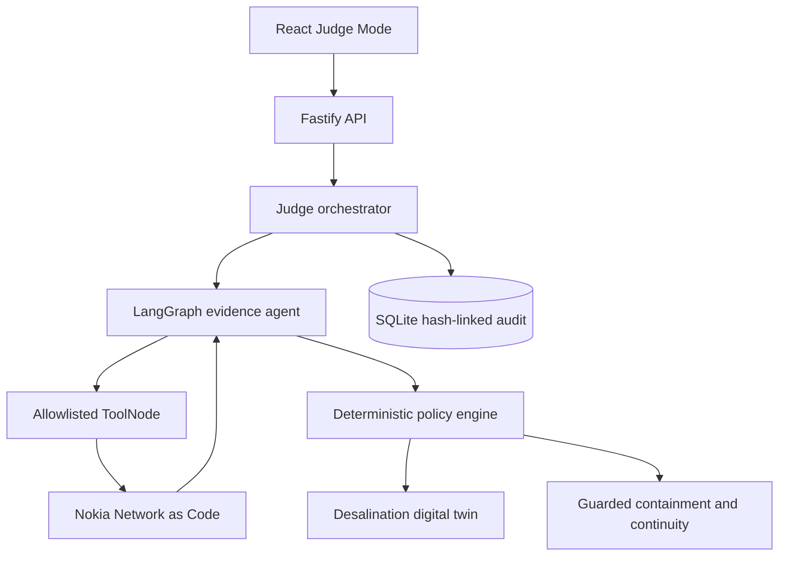
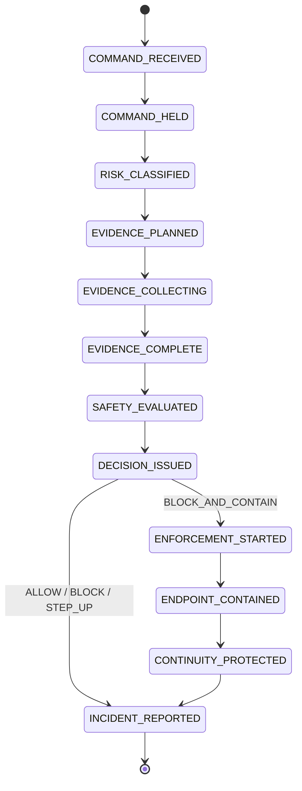

# Architecture

## Authority model

HISN-OT separates three responsibilities:

1. The LangGraph agent selects and interprets network evidence.
2. Nokia Network as Code adapters execute typed CAMARA requests with server-held credentials.
3. The deterministic policy engine alone authorizes accepted control state and containment.

The model receives redacted command, role, plant condition, safety band, and hard maximum. It never receives Nokia or Groq credentials. Tool functions inject the correlation ID, scenario identity, geofence, policy, timeout, and provider configuration from trusted server state.

## Agent graph

The evidence agent uses LangGraph `StateGraph`, `MessagesAnnotation`, and `ToolNode`:

1. Establish the investigation goal.
2. Ask Groq to call one allowlisted evidence tool.
3. Execute the tool through the trusted Nokia provider.
4. Return a typed, redacted observation to the model.
5. Reassess after every observation.
6. Stop when sufficient or when the five-call budget is exhausted.
7. Apply any missing deterministic minimum-evidence floor transparently.
8. Produce a recommendation.
9. Run deterministic authorization.

Read-only status requires Device Reachability. An in-band pressure command requires Number Verification, Location Verification, and Device Reachability. A command above the observed 52% safe band also requires SIM Swap and Device Swap. The 60% hard maximum is independent from this evidence policy.

## Workflow states

The command is held before reasoning or network calls. Every transition is persisted with a correlation ID and SHA-256 chain link. A timed-out side effect retains an uncertain intent and is never retried blindly.

## Module ownership

| Module                                           | Responsibility                                                       |
| ------------------------------------------------ | -------------------------------------------------------------------- |
| `src/infrastructure/langgraph-evidence-agent.ts` | Model/tool/observation loop and structured trace                     |
| `src/infrastructure/agent-reasoners.ts`          | Live planning/recommendation and deterministic fallback              |
| `src/infrastructure/nokia-providers.ts`          | Nokia SDK evidence and programmable-connectivity adapters            |
| `src/application/judge-orchestrator.ts`          | Workflow transitions, cancellation, execution order, incidents       |
| `src/domain/decision-engine.ts`                  | Authoritative policy decision                                        |
| `src/domain/digital-twin.ts`                     | Illustrative plant response with integration steps of at most 100 ms |
| `src/infrastructure/sqlite-audit-store.ts`       | Runs, events, idempotency records, incident persistence              |
| `src/web`                                        | Backend-state rendering and presenter interaction                    |

## Deployment boundary

The deployed application is a single-process prototype. Local SQLite persistence does not provide durable, isolated multi-user state on Vercel. Production use would require durable tenant-scoped storage, enterprise identity, certified OT integration, operator-approved network actions, reconciliation workers, and formal safety/security validation.
